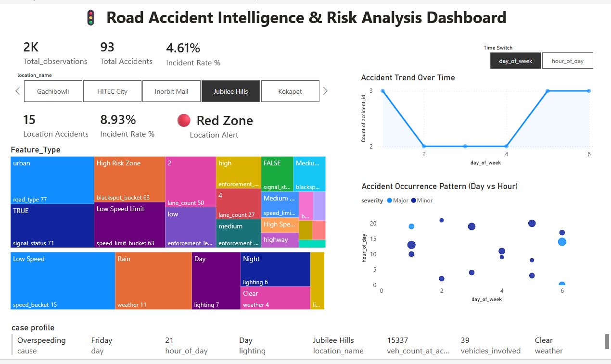
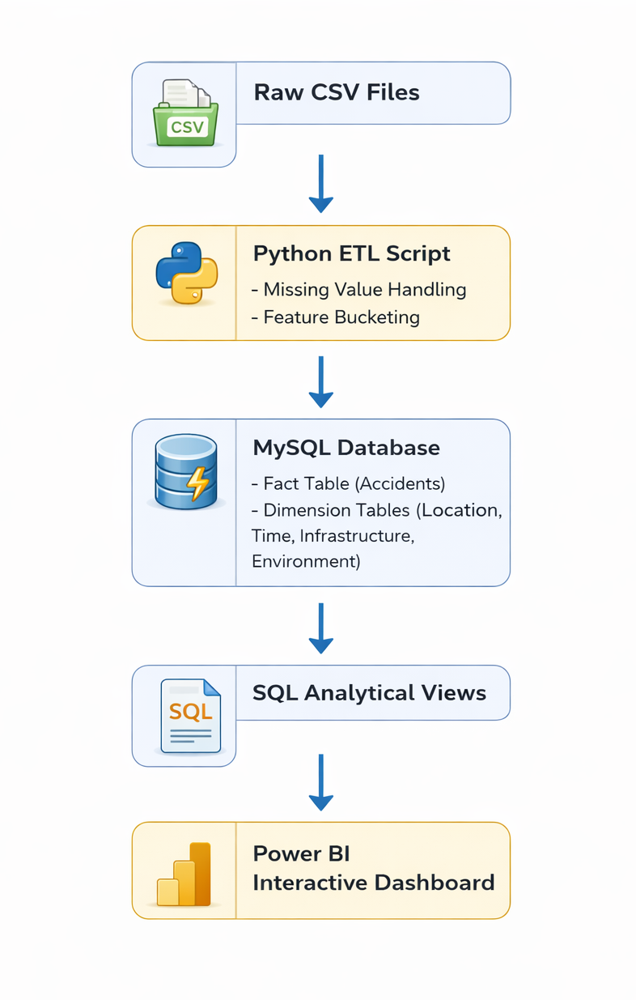

🚦 Road Accident Intelligence & Risk Analysis Dashboard
📌 Project Overview

This project converts structured traffic accident data into actionable risk intelligence using Python, MySQL (Star Schema), and Power BI.

The goal is not just visualization — but identifying high-risk locations, time patterns, and contributing factors to support data-driven safety decisions.

## 📊 Dashboard Preview

🏗 Architecture

Raw CSV Data
→ Python Data Cleaning & Feature Engineering
→ MySQL Star Schema (Fact + Dimensions)
→ SQL Analytical Views
→ Power BI Interactive Dashboard

🧠 Data Engineering & Modeling

Cleaned and transformed raw accident dataset

Created feature buckets (Speed, Blackspot, Enforcement Level)

Designed Star Schema with Fact & Dimension tables

Built optimized SQL views for dashboard analytics

Implemented dynamic interactions using Field Parameters in Power BI

📊 Dashboard Intelligence

📍 Location-Level Risk Comparison

⏱ Dynamic Day / Hour Toggle (Single Smart Chart)

🏗 Infrastructure vs Environmental Risk Analysis

🧩 Interactive Case-Level Drill Down

🚨 High-Risk Zone Identification

📈 Key Insights

93 accidents out of 2016 observations
→ Overall Incident Rate: 4.61%

HITEC City shows 8.33% incident rate
→ Classified as High-Risk (Red Zone)

Night + Rain conditions show increased accident concentration

High Blackspot Scores strongly correlate with accidents

🛠 Tech Stack

Python (Data Cleaning & Feature Engineering)

MySQL (Star Schema & Analytical Views)

Power BI (Interactive Dashboard)

Git & GitHub

🎥 Project Demo

👉 Watch the 3-Minute Walkthrough:
[Project Explanation Video Link]

